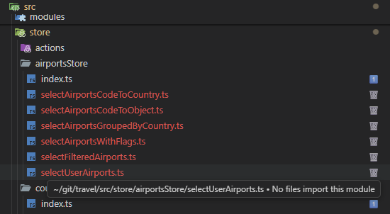
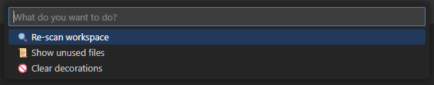
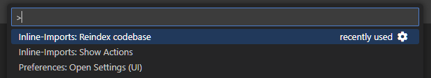
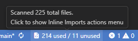
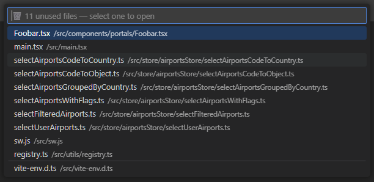

# 🧩 VS Inline Imports

[](https://github.com/rand0mc0d3r/vscode-inline-imports/issues)
[](https://github.com/rand0mc0d3r/vscode-inline-imports/stargazers)

Instantly see how many files import each module — right inside your VS Code explorer.
It’s like knip, but visual. Interactive. And ✨ a little cheeky.

## 🚀 Features


Feature	Description

[](https://marketplace.visualstudio.com/items?itemName=rand0mc0d3r.vs-inline-imports)

- **Inline Import** 📦 - Counts	Shows how many other files reference each module directly in the Explorer
- **Live Updates** 🔄	- Automatically rescans when you save files
- **Dynamic Imports** 💥 -	Supports both static import x from and dynamic import() syntax
- **Visual Flair** 🎨 - Uses emojis and colored badges (configurable)
- **Smarter Scans** 🧠	- Incremental reindexing with caching for speed
- **Unused Files Finder** 🧹 -	Quickly list and open unused modules
- **Configurable** ⚙️	- Customize batch size, icons, colors, and extensions to scan

---

## 🪄 Usage

[](https://marketplace.visualstudio.com/items?itemName=rand0mc0d3r.vs-inline-imports)

- Open your project in VS Code
- The extension starts scanning automatically
- Check the file explorer — badges appear next to your files
- Hover for tooltips showing reference counts
- Use the status bar menu (📦 Imports) for actions:

  - 🔍 Re-scan workspace
  - 📜 Show unused files
  - 🚫 Clear decorations

---

## 🧰 Commands

[](https://marketplace.visualstudio.com/items?itemName=rand0mc0d3r.vs-inline-imports)

Command	Action

```vs-inline-imports.reIndex```	Force re-index the project

```vs-inline-imports.showActions```	Open quick actions menu

---

## ⚙️ Configuration

You can tweak settings in your workspace .vscode/settings.json:

```json
{
  "inlineImports.sourceFolder": "src",
  "inlineImports.fileExtensions": [".ts", ".tsx", ".js", ".jsx"],
  "inlineImports.batchSize": 50,
  "inlineImports.deleteIcon": "✂️",
  "inlineImports.ignoredFiles": ["main.ts", "extension.ts", "**/*.d.ts"]
}
```

### Settings Details

- **sourceFolder**: Root folder to scan for imports (default: `"src"`)
- **fileExtensions**: File extensions to include (default: `[".ts", ".tsx", ".js", ".jsx"]`)
- **batchSize**: Number of files to process per batch (default: `25`)
- **deleteIcon**: Icon for unused files (default: `"🗑️"`)
- **ignoredFiles**: Files to treat as having at least one reference, preventing them from being marked as unused. Supports glob patterns (default: `["main.ts", "extension.ts", "**/*.d.ts"]`)

---

## 📊 Status Bar

[](https://marketplace.visualstudio.com/items?itemName=rand0mc0d3r.vs-inline-imports)

The status bar item shows a quick summary:

```
📦 312 used / 7 unused
```

Hover for details. Click to open actions or rescan.

---

## 🧹 Show Unused Files

[](https://marketplace.visualstudio.com/items?itemName=rand0mc0d3r.vs-inline-imports)

List all unused files directly inside VS Code and open them with one click:

```
🗑️ src/components/OldChart.tsx

🗑️ src/utils/deprecatedParser.js
```

Includes search and separators for clarity.

---

## ⚡ Performance

[](https://marketplace.visualstudio.com/items?itemName=rand0mc0d3r.vs-inline-imports)

- Caches file hashes to skip unchanged files
- Keeps a persistent ts-morph project
- Parallelized scanning batches
- Incremental reindexing after saves

A 300-file React project? **<1 second** re-scan time.

---

## 🛠️ Requirements

- VS Code **1.85+**
- Node.js **18+** (for local extension dev)

---

## ❤️ Contributing

Pull requests, emoji ideas, and ridiculous color schemes welcome.

Run locally with:

```bash
npm install
npm run watch
code --extensionDevelopmentPath=.
```

---

## 📜 License

MIT — because good code should roam free.

---

NOTE: Aid in development was via VSCode Copilot for API surface knowledge and boilerplate.
